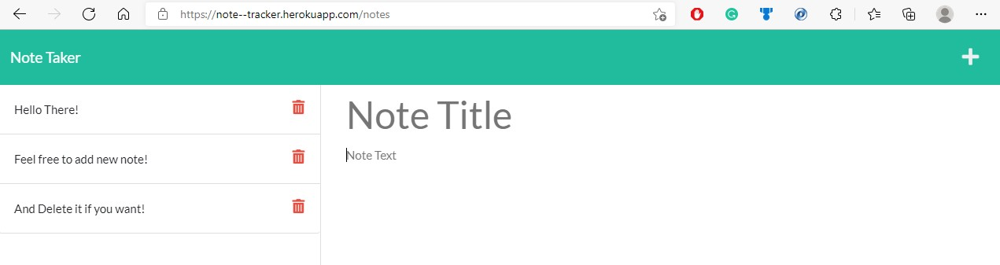

# Note Tracker 

## Description
    
This website allows to handle notes (create, read and delete). Its deployed in Heroku, and use Express.js to handle API request. 

[Heroku website](https://note--tracker.herokuapp.com/notes)



## Table of content
* [Description](#description)
* [Instalation](#installation)
* [Usage Information](#usage-information)


## Installation

To run this project, install it locally using npm:
```
npm i
```

## Usage Information
    
After installing dependencis with ```npm i```, run with node or nodemon the file ```server.js``` 

## Questions
    
[Juan Jose Ramirez Github profile](https://github.com/JuanjoRamirez262)

email: juanjoramirezps@gmail.com

